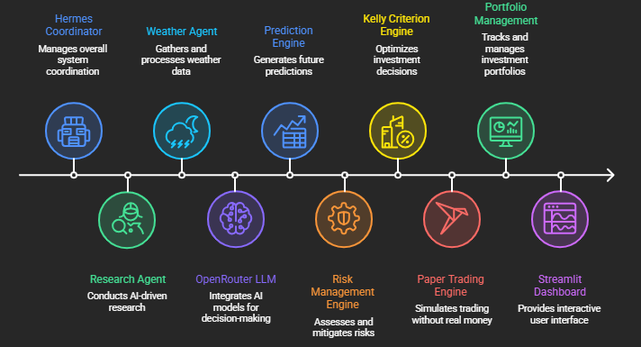
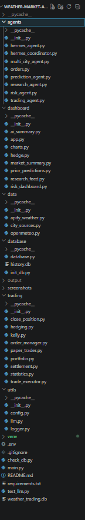
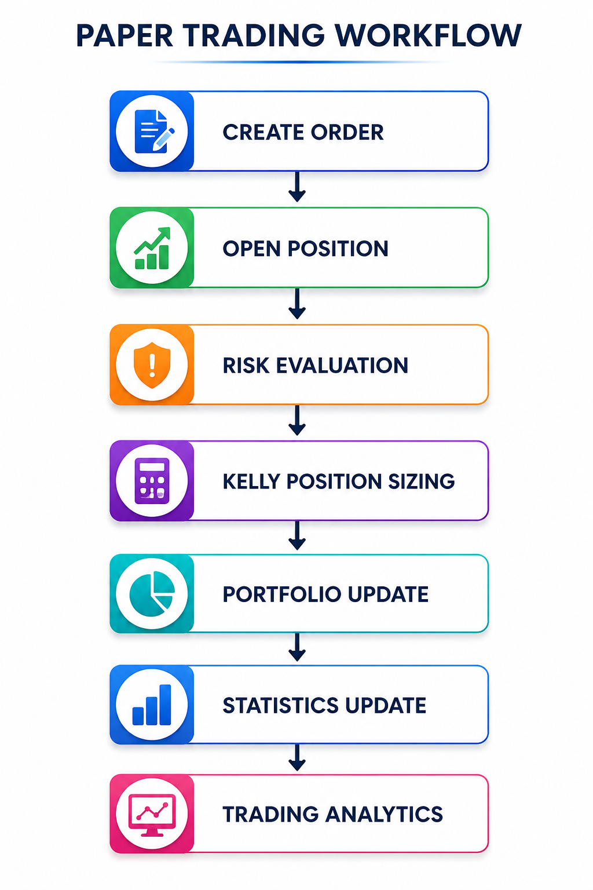
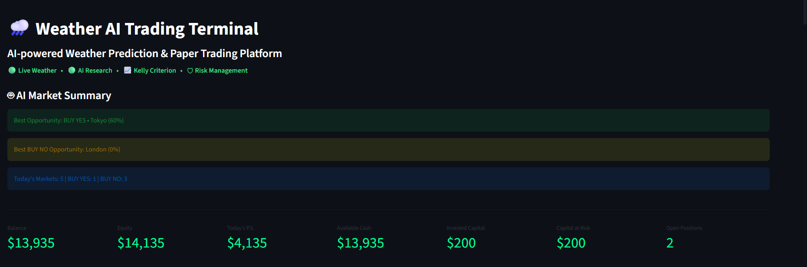
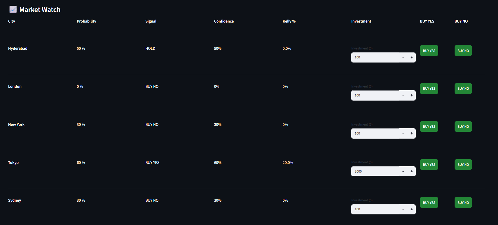
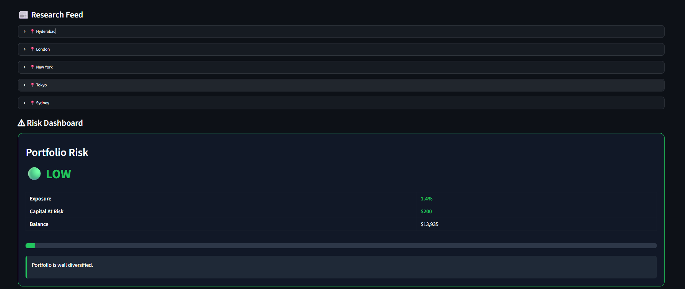
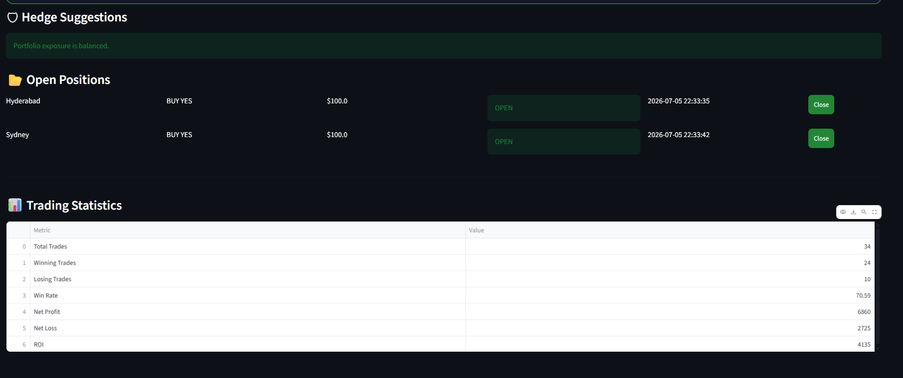
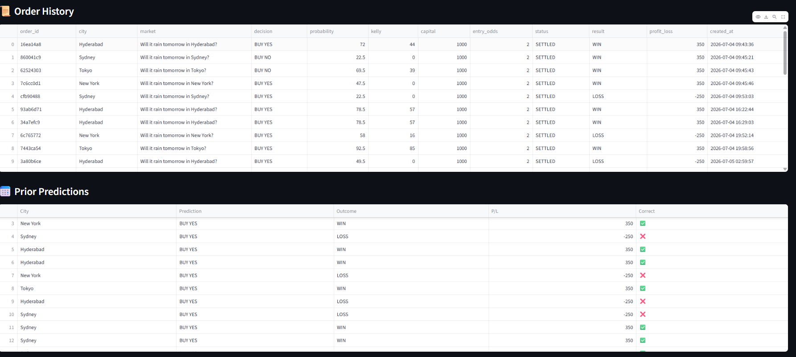
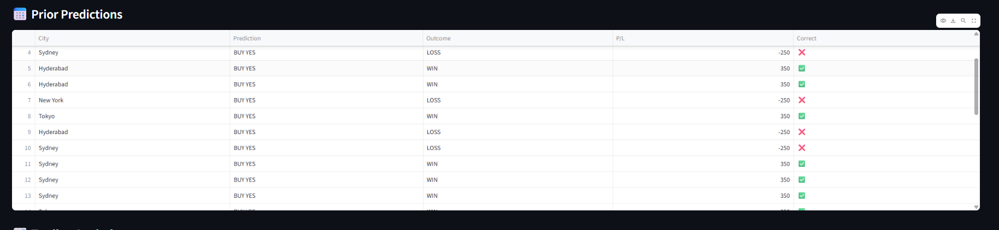
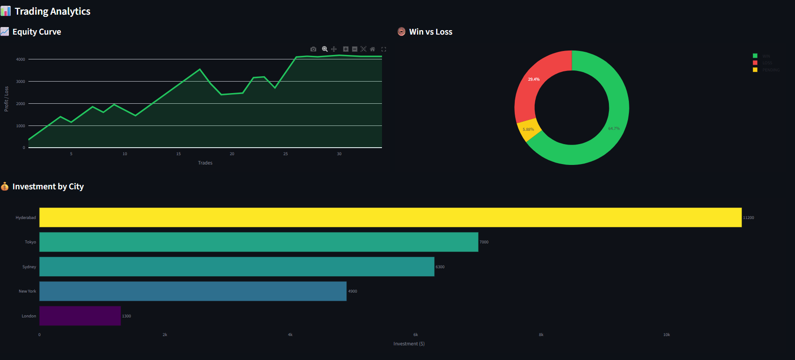

# 🌧️ Weather AI Trading Agent

An AI-powered Weather Prediction and Paper Trading platform developed as part of the **CrowdWisdomTrading Internship Assessment**.

The application uses multiple AI agents to collect weather information, analyze global and local weather conditions, predict rain probability using an LLM, calculate trading risk with the Kelly Criterion, and simulate paper trades through an interactive trading terminal.

The project is inspired by modern prediction markets such as **Polymarket** and weather trading systems like **PolyWeather**, while maintaining a clean modular architecture using Python.

## Project Overview

This project demonstrates how Artificial Intelligence, weather intelligence, and quantitative trading concepts can be combined into a single application.

The system continuously gathers weather information for multiple cities, performs AI-based research and prediction, calculates confidence and risk scores, recommends trades, executes paper trades, manages portfolio exposure, and visualizes trading analytics through a professional dashboard.

The objective is not only to predict weather outcomes but also to demonstrate proper software architecture, agent coordination, portfolio management, and risk-aware trading.

## Features

- 🌍 Multi-city weather collection (5+ cities)
- 🤖 AI-powered weather research using OpenRouter
- 🌦 Global and local weather analysis
- 📊 Rain probability prediction
- 💹 Paper Trading Engine
- 💰 Portfolio Management
- 📈 Kelly Criterion Position Sizing
- ⚠️ Risk Dashboard
- 🛡 Hedge Suggestions
- 📂 Open Positions
- 📜 Order History
- 📊 Trading Statistics
- 📈 Interactive Trading Analytics
- 📋 Prior Predictions
- 🎯 Professional Streamlit Dashboard

## System Architecture

The Weather AI Trading Terminal follows a modular multi-agent architecture. The Hermes Coordinator orchestrates weather collection, AI analysis, prediction, risk management, paper trading, portfolio management, and the Streamlit dashboard.

<p align="center">
  
</p>

## Technology Stack

| Technology | Purpose |
|------------|---------|
| Python | Backend Development |
| Streamlit | Interactive Dashboard |
| SQLite | Local Database |
| Pandas | Data Processing |
| Plotly | Interactive Charts |
| Requests | API Communication |
| OpenRouter | LLM-based Weather Analysis |
| Apify | Weather Data Scraping |

## Project Structure

The project follows a modular architecture where each component has a dedicated responsibility, making the application scalable, maintainable, and easy to extend.



## AI Workflow

1. Collect weather data from multiple sources.
2. Gather both global and local weather conditions.
3. Send collected information to the OpenRouter LLM.
4. Generate weather prediction and confidence score.
5. Calculate portfolio risk.
6. Compute Kelly Criterion position size.
7. Recommend BUY YES or BUY NO.
8. Execute paper trades.
9. Update portfolio and statistics.
10. Display results on the trading dashboard.

## Dashboard Modules

### Portfolio

Displays:

- Balance
- Equity
- Today's Profit/Loss
- Available Cash
- Invested Capital
- Capital at Risk
- Open Positions

### Market Watch

Displays every monitored city with:

- Rain Probability
- AI Decision
- Confidence Score
- Kelly Percentage
- Suggested Investment
- BUY YES
- BUY NO

### Research Feed

Provides AI-generated weather research including:

- Temperature
- Humidity
- Wind Speed
- Rainfall
- AI Research Summary
- Confidence Level

### Risk Dashboard

Displays:

- Portfolio Risk
- Exposure Percentage
- Capital at Risk
- Risk Level
- Portfolio Diversification

### Hedge Suggestions

Analyzes portfolio exposure and suggests opposite positions to reduce trading risk.

### Open Positions

Displays:

- Order ID
- City
- Decision
- Capital
- Status
- Creation Time
- Close Position Option

### Order History

Complete history of every executed paper trade.

### Trading Analytics

Interactive charts including:

- Equity Curve
- Win vs Loss Distribution
- Investment by City

### Prior Predictions

Displays previous weather predictions and their corresponding outcomes for performance evaluation.

## Paper Trading Workflow

The paper trading engine follows a structured workflow from order creation to portfolio analytics. Every trade passes through risk evaluation and Kelly Criterion-based position sizing before updating the portfolio and trading statistics.

<p align="center">
  
</p>

## Risk Management

The application implements:

- Kelly Criterion
- Position Sizing
- Portfolio Exposure
- Capital Allocation
- Risk Dashboard
- Hedge Suggestions

## Installation

Clone the repository:

```bash
git clone https://github.com/YOUR_USERNAME/Weather-AI-Trading-Agent.git
```

Move into the project directory:

```bash
cd Weather-AI-Trading-Agent
```

Install dependencies:

```bash
pip install -r requirements.txt
```

Run the application:

```bash
streamlit run dashboard/app.py
```

## Configuration

Before running the application, configure the following:

- OpenRouter API Key
- Apify API Token

Update the corresponding configuration or environment variables before launching the application.

## Screenshots

### Dashboard



### Market Watch



### Research Feed & Risk Dashboard



### Open Positions & Trading



### Order & Trading History



### Prior Predictions



### Trading Analytics



## Future Improvements

- Live market settlement engine
- Telegram notifications
- Multi-user authentication
- Real-time market odds
- Advanced portfolio optimization
- Historical weather dataset integration
- Additional prediction markets
- Cloud deployment
- Performance benchmarking
- Automated strategy backtesting

## Deliverables

This submission includes:

- Complete Python source code
- Modular AI Agent Architecture
- Interactive Streamlit Dashboard
- SQLite Database
- Paper Trading Engine
- Risk Management System
- Kelly Criterion Implementation
- Screenshots
- Statistical Results
- GitHub Repository

## Acknowledgements

This project was developed as part of the **CrowdWisdomTrading AI Internship Assessment**.

Inspired by:

- PolyWeather
- Polymarket Paper Trader
- OpenRouter
- Apify
- Streamlit
- Plotly

## Author

**Sathya Ankitha Ravirala**

B.Tech – Computer Science & Engineering

GitHub: https://github.com/sathya9100